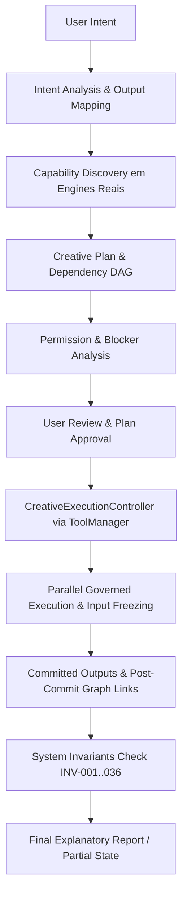

# Athena Creative Orchestration Architecture
## VARYNTH Creation Foundation — Phase 3

O subsistema de **Athena Creative Orchestration** consolida a Athena como a inteligência orquestradora soberana do VARYNTH OS, permitindo converter intenções amplas do usuário em planos criativos multi-Studio inspecionáveis, versionados e governados por políticas formais de permissão.

---

## 1. Princípio Fundamental

```text
USER INTENT ≠ CREATIVE PLAN ≠ EXECUTION PLAN ≠ TASK ≠ ARTIFACT ≠ JOB ≠ OUTPUT ≠ PUBLISH
```

A Athena pode compreender um objetivo sem automaticamente executar todas as ações. O pipeline canônico de orquestração exige aprovação humana explícita antes de qualquer mutação criativa.

---

## 2. Pipeline Canônico de Orquestração



---

## 3. Componentes Centrais

### 3.1 CreativeOrchestrator
- **Decomposição**: Converte `CreativeIntent` em `PlannedArtifact` e `PlannedDependency`.
- **Descoberta Honesta**: Consulta engines reais dos 6 Studios (`Document`, `Web`, `Image`, `Audio`, `Video`, `Game`).
- **DAG & Ciclos**: Valida topologia via `DAGEngine` e rejeita dependências circulares (`PLAN_CYCLE_DETECTED`).
- **Plan Hash Canônico**: Serialização determinística de campos semânticos para proteção anti-TOCTOU.
- **Histórico & Replan**: Preservação de revisões anteriores no histórico sob o Princípio Alex, gerando `PlanDiff` semântico.

### 3.2 CreativeExecutionController
- **Governed Gate**: Todo step transita por `ToolManager` $\rightarrow$ `PermissionPolicyEngine` $\rightarrow$ `SystemInvariantValidator`.
- **Congelamento de Inputs**: Versões dos artefatos de entrada são fixadas (`frozenInputVersions`) no início do step.
- **Isolamento de Outputs**: Outputs transitam por `PRODUCED` $\rightarrow$ `VALIDATING` $\rightarrow$ `PROMOTING` $\rightarrow$ `COMMITTED`. Somente outputs commitados alimentam dependentes.
- **Paralelismo Seguro**: O scheduler detecta `writeTargets` concorrentes e serializa acessos ao mesmo artefato.
- **Sucesso Parcial**: Falhas em steps obrigatórios bloqueiam apenas dependentes diretos (`BLOCKED`), enquanto steps independentes concluem (`PARTIAL` ou `COMPLETED_WITH_WARNINGS`).
- **Manifestos de Proveniência**: Geração de `OrchestrationProvenanceManifest` completo e auditável.

---

## 4. Invariantes do Sistema (INV-021 .. INV-036)

- `INV-021`: Vinculação estrita de revisão em steps de execução.
- `INV-022`: Passagem obrigatória pelo ToolManager e PermissionPolicyEngine.
- `INV-023`: Isolamento de outputs não commitados.
- `INV-024`: Congelamento de versões de entrada durante a execução.
- `INV-025`: Avaliação honesta de conclusão do plano.
- `INV-026`: Semântica explícita de sucesso parcial (`PARTIAL`).
- `INV-027`: Invalidação anti-TOCTOU de aprovações anteriores em revisões novas.
- `INV-028`: Desacoplamento absoluto entre conclusão do plano e publicação.
- `INV-029`: Integridade de proveniência no Grafo Criativo.
- `INV-030`: Relatórios honestos de capacidade sem simulação de falsos sucessos.
- `INV-031`: Correspondência de hash entre plano aprovado e de execução.
- `INV-032`: Prevenção de vazamento de IDs temporários para o Grafo Criativo.
- `INV-033`: Idempotência na retentativa de steps.
- `INV-034`: Completude de manifestos de proveniência.
- `INV-035`: Segurança de outputs commitados em cancelamentos tardios.
- `INV-036`: Declaração prévia ou confirmação para fallbacks com mudança semântica.

