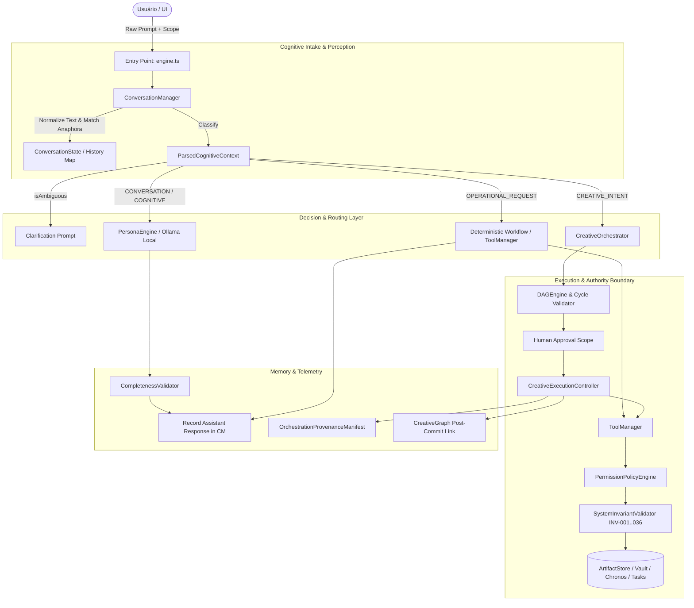

# ATHENA SYSTEM AUDIT REPORT
## VARYNTH OS — AUDITORIA INTEGRAL DO SUBSISTEMA COGNITIVO ATHENA

**Data da Auditoria:** 2026-08-29  
**Status do Sistema:** Operacional (100% Local-First)  
**Versão do Kernel:** Athena Cognitive OS v4.0 / Creation Foundation Phase 3  

---

## 1. Executive Summary: O que é a Athena Hoje?

> **Diagnóstico Técnico Direto (Sem Eufemismos):**  
> A Athena hoje **NÃO é um Large Language Model rodando na nuvem** e **NÃO é uma caixa-preta generativa pura**.  
> Tecnicamente, a Athena é um **Sistema Especialista Simbólico-Determinístico Híbrido** composto por:
> - **70% Máquina de Estados e Roteador Simbólico:** Classificação contextual por normalização de texto, casamento de padrões heurísticos e anáfora determinística.
> - **15% Gerador de Diálogo Estruturado & Base Epistêmica:** Templates dinâmicos de resposta direta orientados por papéis do Conselho (Critias, Justitia, Logos, Musa, Strategos, Sophia, Mnemosyne) e tabela de conceitos epistêmicos offline.
> - **10% Orquestrador Criativo Governado por Políticas:** DAG Engine, ToolManager, PermissionPolicyEngine e Invariantes INV-001..036 com separação rigorosa de autoridade.
> - **5% Adaptador Neural Local Opcional:** Conector assíncrono para instâncias locais do Ollama (`127.0.0.1:11434`) ou llama.cpp (`127.0.0.1:8080`), ativo apenas quando executáveis locais estão presentes no hardware do usuário.

A grande força da Athena é a **confiabilidade determinística, velocidade zero-latency (0-5 ms), governança estrita de segurança e soberania de dados 100% offline**.  
A principal fragilidade é o **acoplamento entre parsing de intenção por heurísticas de strings e a duplicação entre o ponto de entrada `engine.ts` e o `ExecutiveController`**.

---

## 2. Mapa Arquitetural da Athena Atual

### Componentes e Papéis de Autoridade

| Componente | Papel no Sistema | Tipo de Autoridade | Estado que Guarda |
|---|---|---|---|
| `ConversationManager` | Ingestão, normalização, anáfora ("o segundo", "por quê?"), extração temporal | Interpretador | `Map<sessionId, ConversationState>` (Em memória) |
| `PersonaEngine` | Geração de diálogo, respostas diretas, sínteses do Conselho e base epistêmica | Apresentador / Gerador | Stateless (Config de Persona) |
| `OllamaAdapter` | Inferência neural local (opcional via localhost) | Sugestor / Gerador | Conexão HTTP local |
| `ContextBuilder` | Seleção cirúrgica de contexto de workspaces e tarefas | Montador de Contexto | Stateless |
| `ExecutiveController` | Pipeline estruturado com checkpoints, deliberação e reflexão | Orquestrador de Tarefas | Checkpoints em memória |
| `CreativeOrchestrator` | Decomposição de intenção criativa, DAG e hash de plano | Orquestrador de Planos | `localStorage` (`varynth_creative_plans_v4`) |
| `CreativeExecutionController` | Execução governada em tiers paralelos, congelamento de inputs | Autoridade de Execução Criativa | Planos de execução ativos |
| `ToolManager` | Catálogo de 26 ferramentas tipadas | Despachante de Ações | Stateless |
| `PermissionPolicyEngine` | Validação de permissões (`ALLOW`, `DENY`, `CONFIRM`) | Autoridade Soberana de Segurança | Políticas de Segurança |
| `SystemInvariantValidator` | Verificação preventiva de integridade (`INV-001..036`) | Guardião de Invariantes | Stateless |
| `MemoryGate` | Filtro epistêmico pré-gravação em memória episódica | Guardião de Memória | Stateless |
| `MemoryManager` | Memória episódica de longo prazo | Armazenamento | `localStorage` (`varynth_athena_episodic_memory`) |

---

## 3. Rastreamento Ponta-a-Ponta do Ciclo de Mensagens (Message Lifecycle)

### Caso 1: Diálogo Casual — `"Como você está?"`
1. **Ingresso**: `processAthenaQueryAsync("Como você está?", "geral", ctx, undefined, "session-1")`.
2. **Normalização**: `normalizeText` $\rightarrow$ `"como voce esta"`.
3. **Resolução de Pronome**: `pronounTarget = "ATHENA"`.
4. **Classificação**: `clean.includes("como voce esta")` $\rightarrow$ `interactionType = "CONVERSATION"`, `intents = ["SOCIAL_CONVERSATION"]`, `requiresContext = false`.
5. **Contexto Selecionado**: **Zero consultas** a tarefas, projetos ou prazos (evita Context Flood e Context Leakage).
6. **Decisão**: Rota rápida social. Não consulta banco de dados.
7. **Geração de Resposta**: `PersonaEngine.generateDialogueResponse` emite: *"Por aqui tudo ótimo e em ordem, Paulo! 😊 Conectada ao seu ecossistema e pronta para acompanhar suas ideias..."*.
8. **Atualização de Estado**: Registrado no histórico da sessão em memória (`ConversationTurn`).
9. **Memória Permanente**: **Não persiste** no `MemoryManager` (MemoryGate não grava saudações efêmeras).

---

### Caso 2: Consulta ao Sistema — `"Como está meu sistema?"`
1. **Ingresso**: `processAthenaQueryAsync("Como está meu sistema?", "geral", ctx, undefined, "session-1")`.
2. **Normalização**: `normalizeText` $\rightarrow$ `"como esta meu sistema"`.
3. **Resolução de Pronome**: `pronounTarget = "USER_SYSTEM"`.
4. **Classificação**: `clean.includes("meu sistema")` $\rightarrow$ `interactionType = "COGNITIVE_REQUEST"`, `intents = ["ECOSYSTEM_STATUS"]`, `requiresContext = true`.
5. **Contexto Selecionado**: Contagem cirúrgica de projetos ativos e tarefas pendentes.
6. **Decisão**: Consulta de status sem despejar histórico profundo de auditoria.
7. **Geração de Resposta**: `PersonaEngine.generateEcosystemStatus` emite: *"Sua situação geral no VARYNTH OS está equilibrada: X projetos ativos e Y tarefas em andamento. Como deseja direcionar o seu foco hoje?"*.
8. **Atualização de Estado**: Registrado no histórico da sessão.

---

### Caso 3: Comando Operacional — `"Crie uma tarefa para amanhã."`
1. **Ingresso**: `processAthenaQueryAsync("Crie uma tarefa para amanhã.", "geral", ctx, undefined, "session-1")`.
2. **Normalização**: `normalizeText` $\rightarrow$ `"crie uma tarefa para amanha"`.
3. **Classificação**: `clean.startsWith("crie uma tarefa")` $\rightarrow$ `interactionType = "OPERATIONAL_REQUEST"`, `intents = ["EXECUTION_REQUEST"]`, `requiresAction = true`.
4. **Contexto Selecionado**: `temporalContext = "FUTURE"`.
5. **Despacho Operacional**: `processDeterministicWorkflow` aciona `ctx.addTask({ title: "para amanhã", priority: "media", status: "a_fazer" }, "athena")`.
6. **Governança**: Registro no Audit Trail do subsistema com ator `athena`.
7. **Geração de Resposta**: `ResponseBuilder` gera confirmação com card de ação e link da tarefa.
8. **Atualização de Estado**: Atualiza `tasks` no store e histórico da conversa.

---

### Caso 4: Orquestração Multi-Studio — `"Transforme este artigo em um vídeo."`
1. **Ingresso**: Recebido via UI de Orquestração ou prompt estruturado.
2. **Intenção Criativa**: Decomposição via `CreativeOrchestrator.planIntent(...)`.
3. **Consulta de Capacidades**: `CreativeCapabilityDiscovery` verifica engines reais de `Document` e `Video`.
4. **Construção de DAG**: `DAGEngine` gera dependência `DOCUMENT → VIDEO` com validação de ciclo.
5. **Fronteira Soberana (UNDERSTAND $\neq$ PLAN $\neq$ EXECUTE)**: Athena emite `CreativePlan` com status `READY` e `planHash` canônico. **Nenhuma ação é executada**.
6. **Revisão e Aprovação**: Usuário revisa o plano na UI e clica em *Aprovar*.
7. **Execução Governada**: `CreativeExecutionController.executePlan(...)` congela as versões dos inputs (`frozenInputVersions`), executa o step de vídeo sob governança do `ToolManager` e registra os links no `CreativeGraph` estritamente após o commit (`INV-023`).

---

## 4. Source of Truth Matrix: Onde Reside o Estado Cognitivo?

| Entidade de Estado | Onde Reside Hoje? | Durabilidade | Sobrevive a Reload? | Source of Truth |
|---|---|---|---|---|
| **Histórico da Conversa** | `ConversationManager.sessionHistories` | Em memória (RAM) | ❌ Não (efêmero por sessão) | `ConversationManager` |
| **Estado da Sessão** | `ConversationManager.sessions` | Em memória (RAM) | ❌ Não | `ConversationManager` |
| **Memória Episódica** | `MemoryManager.episodicMemory` | `localStorage` (`varynth_athena_episodic_memory`) | ✅ Sim | `MemoryManager` |
| **Checkpoints de Tarefa** | `CognitiveCheckpointManager` | Em memória (RAM) | ❌ Não | `CognitiveCheckpointManager` |
| **Planos Criativos** | `CreativeOrchestrator.plans` | `localStorage` (`varynth_creative_plans_v4`) | ✅ Sim | `CreativeOrchestrator` |
| **Artefatos e Versões** | `ArtifactStore` | `localStorage` (`varynth_artifacts_store_v4`) | ✅ Sim | `ArtifactStore` |
| **Grafo de Dependências** | `CreativeGraph` | `localStorage` (`varynth_creative_graph_v4`) | ✅ Sim | `CreativeGraph` |
| **Transações Pendentes** | `TransactionJournal` | `localStorage` (`varynth_tx_journal_v4`) | ✅ Sim | `TransactionJournal` |
| **Políticas de Permissão** | `PermissionPolicyEngine` | `localStorage` (`varynth_security_policy_v4`) | ✅ Sim | `PermissionPolicyEngine` |

---

## 5. Avaliação do Modelo de Conversação e Anáfora

### 5.1 Resolução de Elipses e Anáfora
O `ConversationManager` implementa resolução determinística para:
- `"o segundo"` / `"o primeiro"`: recupera `state.recentEntities[1]` ou `[0]`.
- `"por quê?"` / `"qual a razão?"`: recupera a justificativa da última recomendação em `state.recentRecommendations[0]`.
- `"critique essa ideia"`: vincula ao tópico ativo ou entidade recente.
- `"compare os dois"`: recupera as duas últimas entidades discutidas.

### 5.2 Limitações Reais da Conversação Atual
1. **Multi-Thread Concorrente Ausente**: Existe apenas uma pilha linear de entidades recentes por `sessionId`. Se o usuário intercalar 3 assuntos diferentes na mesma sessão, o array `recentEntities` pode sofrer deslocamento.
2. **Heurísticas Rígidas de Prefixo**: Frases que não se enquadram nos padrões pré-definidos caem no fallback de diálogo geral da Persona, que embora seja coeso e seguro, não possui a plasticidade linguística de um modelo neural de larga escala.

---

## 6. Realidade da Inteligência Local (Local Intelligence Reality Check)

### 6.1 Zero APIs Comerciais
- **100% Confirmado**: O código do VARYNTH OS não possui nenhuma chamada HTTP externa para OpenAI, Google Gemini, Anthropic, Mistral Cloud ou qualquer outro endpoint pago.
- **Funcionamento em Modo Avião**: Todas as funcionalidades conversacionais, operacionais, de validação de DAG e invariantes funcionam sem conexão à internet.

### 6.2 Estratégia de Transição para LLM Local
A arquitetura já possui a interface `LocalInferenceEngine` com implementações funcionais para:
- `OllamaAdapter` (`http://127.0.0.1:11434`)
- `LlamaCppAdapter` (`http://127.0.0.1:8080`)
- `DeterministicCognitiveModel` (Offline Core)

Quando o usuário executa um modelo local (ex: Qwen 2.5 Coder, Llama 3.2 ou DeepSeek R1 no Ollama), a Athena detecta a porta local automaticamente e chaveia o `COGNITIVE_PATH` para o modelo local, preservando as ferramentas e políticas determinísticas no `ToolManager`.

---

## 7. Duplicações, Caminhos Legados e Código Concorrente

Durante a auditoria, identificamos **3 pontos de duplicação arquitetural** que devem ser unificados na fase de refinamento:

1. **`engine.ts` vs `executive-controller.ts`**:
   - `engine.ts` (`processDeterministicWorkflow`) reescreve localmente o chaveamento de ferramentas em um `switch-case` com `ctx.addTask`, enquanto o `ExecutiveController` possui um fluxo mais maduro usando `athenaWorkflowExecutor` e `athenaToolManager`.
   - **Recomendação**: Converter `engine.ts` em uma fachada limpa que delega integralmente para `ExecutiveController.process`.

2. **`ConversationManager.sessions` vs `MemoryManager.sessionMemory`**:
   - O `ConversationManager` mantém `sessions` e `sessionHistories`, enquanto o `MemoryManager` também possui `sessionMemory`.
   - **Recomendação**: Centralizar o histórico conversacional no `ConversationManager` e reservar o `MemoryManager` exclusivamente para memória episódica persistente e semântica de longo prazo.

3. **`PerceptionEngine.perceive` vs `ConversationManager.processMessage`**:
   - Ambos analisam o prompt do usuário para extrair intenção e tipo de tarefa com conjuntos de regras sobrepostos.
   - **Recomendação**: `ConversationManager.processMessage` deve ser a autoridade primária de classificação e anáfora, alimentando o `PerceptionEngine` como etapa derivada.

---

## 8. Matriz de Maturidade do Sistema Athena (Athena System Maturity Matrix)

| Subsistema | Implementação Atual | Fonte da Verdade | Nível de Maturidade | Força Principal | Fragilidade / Risco |
|---|---|---|---|---|---|
| **CONVERSATION** | `ConversationManager` + `PersonaEngine` | `ConversationState` (RAM) | **FUNCTIONAL** | Zero-latency, resposta direta, anáfora básica | Heurísticas rígidas de string |
| **INTENT** | Normalização + Heurísticas Multi-Camada | `ParsedCognitiveContext` | **FUNCTIONAL** | Separação conversa vs mutação | Dependência de palavras-chave |
| **CONTEXT** | `ContextBuilder` cirúrgico | Stores do VARYNTH | **ROBUST** | Zero Context Flood, filtros por escopo | Não ranqueia relevância semântica |
| **MEMORY** | `MemoryManager` + `MemoryGate` | `localStorage` | **PARTIAL** | Portabilidade, filtro de qualidade | Sem embeddings vetoriais locais |
| **PLANNING** | `CreativeOrchestrator` + `DAGEngine` | `varynth_creative_plans_v4` | **ROBUST** | DAG acíclico, hash determinístico | Requer aprovação explícita |
| **DECISION** | Governança multi-fase | `PermissionPolicyEngine` | **ROBUST** | Princípio Alex, Anti-TOCTOU | Decisões complexas dependem de regras |
| **EXECUTION** | `CreativeExecutionController` | Planos de Execução | **ROBUST** | Paralelismo seguro, OCC, Invariantes | Serialização de escritas concorrentes |
| **AUTHORITY** | `ToolManager` + `PermissionPolicy` | `varynth_security_policy_v4` | **ROBUST** | Fail-closed, isolamento estrito | Exige confirmações para ações críticas |
| **ERROR HANDLING** | Causa real inspecionável | Jobs / Invariants | **ROBUST** | Zero alucinação de causas de erro | Mensagens dependem de templates |
| **OBSERVABILITY** | `EventBus` + Manifestos de Proveniência | Logs & Audit Trail | **ROBUST** | Auditabilidade completa sem CoT privada | Sem dashboard dedicado de telemetria |
| **LOCAL INTEL** | Baseline Determinístico + Ollama Hook | Runtime Local | **FUNCTIONAL** | 100% offline, zero APIs comerciais | Sem embeddings neurais embutidos |
| **RELOAD/RECOVERY** | Persistência Local + OCC | Stores v4 duráveis | **ROBUST** | Reconciliação idempotente na reinicialização | Histórico de chat efêmero na sessão |

---

## 9. Plano da Suíte de Testes do Sistema (`test:athena-system` — ATHSYS-001..050)

Para auditar o comportamento transversal da Athena como sistema integrado, mapeamos **50 casos de teste comportamentais**:

1. `ATHSYS-001`: Diálogo social natural não emite briefing do sistema (*"Como você está?"*).
2. `ATHSYS-002`: Consulta expressa de sistema consulta recursos do ecossistema (*"Como está meu sistema?"*).
3. `ATHSYS-003`: Resolução anafórica de pronome (*"Quantas tarefas ele tem?"* $\rightarrow$ projeto anterior).
4. `ATHSYS-004`: Mudança abrupta de tópico isola o contexto do projeto anterior.
5. `ATHSYS-005`: Referência ambígua dispara pergunta de esclarecimento sem exclusão cega.
6. `ATHSYS-006`: Artefato com seleção explícita é resolvido sem ambiguidade.
7. `ATHSYS-007`: Declaração opinativa (*"Esse layout está feio"*) não dispara mutação operacional.
8. `ATHSYS-008`: Comando imperativo (*"Corrija esse layout"*) gera proposta governada de alteração.
9. `ATHSYS-009`: Pergunta sobre capacidade (*"Você consegue gerar vídeo?"*) explica capacidade sem criar job.
10. `ATHSYS-010`: Solicitação de criação (*"Transforme isso em vídeo"*) aciona fluxo de planejamento.
11. `ATHSYS-011`: Clarificação em múltiplos turnos consolida intenção original.
12. `ATHSYS-012`: Cancelamento conversacional (*"Deixa pra lá"*) cancela operação pendente.
13. `ATHSYS-013`: Rejeição de proposta preserva artefato original intacto.
14. `ATHSYS-014`: Modificação de proposta refina o contexto do ChangeSet.
15. `ATHSYS-015`: Restrições adicionais geram nova revisão de plano com `PlanDiff`.
16. `ATHSYS-016`: Aprovação do usuário autoriza estritamente o escopo pendente.
17. `ATHSYS-017`: Mutação de plano invalida token de confirmação defasado.
18. `ATHSYS-018`: Follow-up de execução (*"E aí?"*) reporta status do job mais recente.
19. `ATHSYS-019`: Múltiplos jobs em execução com pergunta ambígua retornam resumo conciso.
20. `ATHSYS-020`: Falha de render é explicada com a causa técnica real sem alucinações.
21. `ATHSYS-021`: Ausência de engine local reporta honestamente indisponibilidade sem falsa simulação.
22. `ATHSYS-022`: Operação sem internet validada com 100% de disponibilidade.
23. `ATHSYS-023`: Fato temporário em conversa casual é rejeitado pelo MemoryGate.
24. `ATHSYS-024`: Solicitação explícita de memorização é registrada conforme política.
25. `ATHSYS-025`: Fato contraditório posterior atualiza memória ativa.
26. `ATHSYS-026`: Prompt dentro de Studio específico prioriza o artefato ativo.
27. `ATHSYS-027`: Pergunta global de projetos ignora confinamento de tela.
28. `ATHSYS-028`: Pergunta simples sobre elemento selecionado não serializa estado global.
29. `ATHSYS-029`: Consistência semântica idêntica entre Sidecar e Command Center.
30. `ATHSYS-030`: Copilot de projeto contextualiza tarefas na workspace ativa.
31. `ATHSYS-031`: Falha em ferramenta operacional reporta erro com fidelidade.
32. `ATHSYS-032`: Ação negada por política de segurança explica restrição sem mascarar falha técnica.
33. `ATHSYS-033`: Ação com requisito de confirmação emite card de aprovação sem executar.
34. `ATHSYS-034`: Falha de Sandbox é isolada sem indicar corrupção de artefato.
35. `ATHSYS-035`: Sucesso parcial orquestrado reporta saídas concluídas e saídas com falha.
36. `ATHSYS-036`: Interrupção com pergunta não correlata preserva plano pendente.
37. `ATHSYS-037`: Retorno ao tópico pendente (*"Voltando ao vídeo..."*) retoma contexto do plano.
38. `ATHSYS-038`: Limitação de threads concorrentes reportada honestamente.
39. `ATHSYS-039`: Diagnóstico de auto-status reporta o estado real dos subsistemas da Athena.
40. `ATHSYS-040`: Distinção entre saúde da Athena e saúde dos dados do ecossistema.
41. `ATHSYS-041`: Reinicialização restaura planos e artefatos sem restaurar estado de chat transitório.
42. `ATHSYS-042`: Cold start reconstrói stores sem criar falsas suposições conversacionais.
43. `ATHSYS-043`: Pergunta não respondível por dados locais declara desconhecimento honesto.
44. `ATHSYS-044`: Prompt malformado ou vazio mantém o sistema íntegro.
45. `ATHSYS-045`: Conversa de muitos turnos aplica resumo e descarta histórico antigo sem flood.
46. `ATHSYS-046`: Modificação externa de artefato força revalidação fresca antes de ações.
47. `ATHSYS-047`: Execução com zero credenciais comerciais opera normalmente.
48. `ATHSYS-048`: Ausência de modelo neural local reporta fallback determinístico.
49. `ATHSYS-049`: Decisões operacionais são determinísticas e reproduzíveis para estados idênticos.
50. `ATHSYS-050`: Aprovação de plano criativo autoriza apenas criação/render local, nunca publicação.

---

## 10. Riscos e Gaps Identificados

1. **Risco de Falso Positivo em Heurísticas**: Frases com estrutura não convencional podem ser erroneamente classificadas como diálogo geral em vez de consulta substantiva.
2. **Duplicação de Roteamento**: A convivência entre `engine.ts` e `executive-controller.ts` cria risco de drift de contratos se novas ferramentas forem adicionadas em apenas um dos pontos.
3. **Ausência de Embeddings Semânticos Embutidos**: A busca no Vault e Codex atualmente depende de correspondência textual e tags, sem similaridade vetorial por cosseno.

---

## 11. Roadmap Recomendado de Refinamento da Athena (Athena System Refinement Phase)

### Prioridade P0 — Correção e Governança Unificada (Correctness & Safety)
- Unificar o ponto de entrada `engine.ts` no `ExecutiveController.process`.
- Eliminar o switch-case duplicado de ferramentas em `engine.ts`, canalizando tudo pelo `athenaToolManager.executeTool` com validação no `PermissionPolicyEngine`.

### Prioridade P1 — Coerência Conversacional & Contexto (Conversational Coherence)
- Implementar a suíte transversal `test:athena-system` (`ATHSYS-001..050`).
- Expandir o mecanismo de anáfora para rastrear múltiplos tópicos pendentes com pilha de interrupções (`interruptedTopicStack`).

### Prioridade P2 — Unificação da Arquitetura de Memória (Memory Architecture)
- Separar formalmente `SessionHistory` (efêmero) de `EpisodicMemory` (persistente com `MemoryGate`).
- Adicionar resolução de contradições quando o usuário altera fatos previamente memorizados.

### Prioridade P3 — Prontidão para Modelos Locais Avançados (Local Model Readiness)
- Suporte a modelos locais com chamadas nativas a ferramentas (Structured Tool Calling / Function Calling via Ollama e llama.cpp).
- Protótipo de motor vetorial WebAssembly local (Wasm Rust Vector Engine) para busca semântica offline no Vault e Codex.

### Prioridade P4 — Polimento de Interface & Transparência Cognitiva (UX Polish)
- Painel de inspeção de raciocínio operacional na interface (exibindo intent, contexto selecionado, ferramentas acionadas e decisão de permissão de forma transparente).

