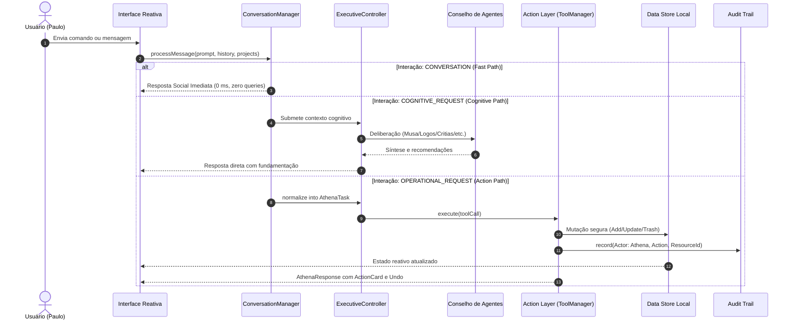

# Fluxo de Dados & Mutações Reativas — VARYNTH OS

## 1. Visão Geral
O fluxo de dados no **VARYNTH OS** opera sob o paradigma de **Imutabilidade Auditável e Reatividade Local**. Nenhuma mutação de estado é realizada de forma silenciosa ou opaca: cada criação, alteração ou exclusão gera um registro tipado na trilha de auditoria e propaga alterações para os componentes da interface.

---

## 2. Diagrama de Fluxo Ponta a Ponta



---

## 3. As Três Vias de Execução

### A. Via Rápida (Fast Path - `CONVERSATION`)
- **Latência**: < 1 ms
- **Uso de Banco**: Zero leituras e zero mutações.
- **Finalidade**: Tratar saudações, desabafos, humor (*"kkk"*, *"tá foda em"*) e perguntas sociais (*"como você está?"*).
- **Garantia**: Impede que conversas cotidianas sobrecarreguem o sistema com despejo indevido de relatórios.

### B. Via Cognitiva (Cognitive Path - `COGNITIVE_REQUEST`)
- **Latência**: 10 ms (Determinístico) a 400 ms (Inference local Ollama)
- **Uso de Banco**: Leitura cirúrgica sob demanda (*Minimal Disclosure*).
- **Finalidade**: Ideação com **Musa**, recomendações com **Strategos**, análise científica com **Logos**, rigor dialético com **Justitia** e crítica de riscos com **Critias**.
- **Garantia**: Responde primeiro ao que foi pedido e valida a completude com o `ResponseCompletenessValidator`.

### C. Via Operacional (Operational Path - `OPERATIONAL_REQUEST`)
- **Latência**: 5 ms a 20 ms
- **Uso de Banco**: Mutações estritas via `ToolManager`.
- **Finalidade**: Criar tarefas, notas, agendar marcos e mover itens para a lixeira.
- **Garantia**: Carimbo de ator (`actorType: "user" | "athena" | "system"`), suporte a Desfazer (*Undo*) e bloqueio *Fail-Closed* para ações ambíguas.

---

## 4. O Barramento de Eventos (`AthenaEventBus`)
Mutações e transições de estado cognitivo emitem eventos desacoplados através do `AthenaEventBus` (`src/lib/athena/events/event-bus.ts`):

```ts
export type AthenaEventType =
  | "TASK_CREATED"
  | "TASK_UPDATED"
  | "TOOL_EXECUTED"
  | "MEMORY_STORED"
  | "DELIBERATION_COMPLETED"
  | "CONFIDENCE_ASSESSED"
  | "BUDGET_EXCEEDED"
  | "RESPONSE_READY"
  | "AUDIT_RECORDED";
```

A interface e os sidecars subscrevem esses tópicos para atualizar gráficos, badges de telemetria e notificações em tempo real.

