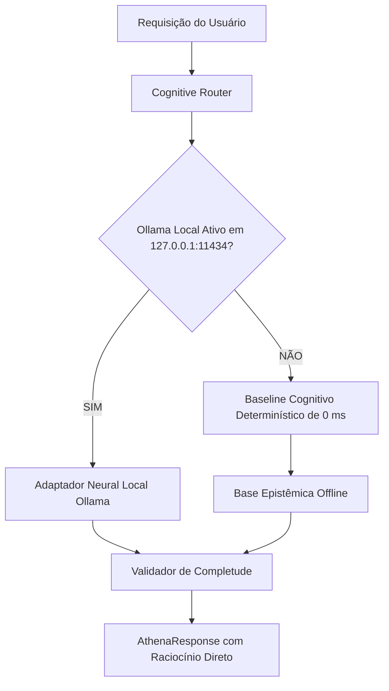

# Arquitetura Local-First & Soberania Tecnológica — VARYNTH OS

## 1. Visão Geral
A arquitetura do **VARYNTH OS** foi estabelecida sob o princípio imutável da **Soberania Tecnológica**: o sistema é concebido para operar com máxima inteligência e funcionalidade completa **sem depender de nenhuma API de IA proprietária comercial externa** (como OpenAI, Anthropic ou Google Gemini).

---

## 2. Por que Local-First?
Trabalho intelectual avançado, formulação de teses jurídicas e gestão de projetos acadêmicos envolvem segredos industriais, dados protegidos por sigilo profissional e formulações inéditas. O paradigma Local-First garante:
1. **Privacidade Inegociável**: Nenhum prompt, anotação ou documento sai do dispositivo do usuário.
2. **Independência Operacional**: O VARYNTH OS continua funcionando normalmente no modo avião, em locais remotos ou durante quedas de infraestrutura global de nuvem.
3. **Custo Zero Recorrente**: Sem cobranças por tokens ou assinaturas de APIs externas para manter a inteligência ativa.

---

## 3. Modelo Híbrido de Inferência Local

---

## 4. O Baseline Cognitivo Determinístico
Quando nenhum servidor Ollama local está ativo, a Athena **não falha nem exibe erros**:
- Aciona o **Conselho de 7 Especialistas** (`Justitia`, `Logos`, `Sophia`, `Musa`, `Strategos`, `Mnemosyne`, `Critias`).
- Consulta a **Base Epistêmica Offline** (`src/lib/athena/knowledge/epistemic-concepts.ts`), que contém definições fundamentais sobre Hermenêutica Jurídica, Teoria Geral dos Jogos, Método Científico, Epistemologia e Latim Forense.
- Processa fluxos com **latência de 0 ms**, consumindo zero recursos adicionais de CPU/GPU.

---

## 5. Integração com Ollama Local (Auto-Detecção)
O adaptador `OllamaAdapter` (`src/lib/athena/models/providers/ollama-adapter.ts`) realiza varredura automática em background na porta local padrão `http://127.0.0.1:11434/api/tags`:
- Se o Ollama for iniciado pelo usuário com qualquer modelo local (ex: `llama3`, `mistral`, `deepseek-r1`, `phi3`), a Athena detecta imediatamente e eleva a fluidez conversacional.
- Se o serviço for fechado, o sistema retorna instantaneamente ao baseline determinístico sem interrupção de serviço.
