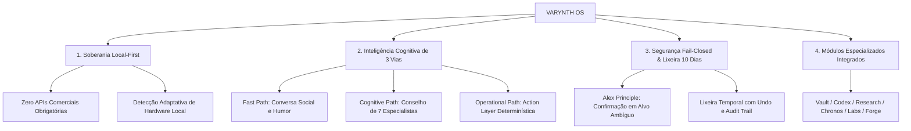

# Visão Geral da Arquitetura — VARYNTH OS

## 1. Visão Geral
O **VARYNTH OS** é um sistema operacional cognitivo soberano, projetado para amplificar a produtividade intelectual, pesquisa acadêmica, formulação jurídica e gestão estratégica de projetos em um ambiente estritamente **Local-First**. O ecossistema unifica interfaces modulares de alto desempenho a um núcleo de inteligência cognitiva autônoma (**Athena**), operando de forma 100% offline e independente de APIs comerciais externas.

---

## 2. Problema que Resolve
Sistemas tradicionais de produtividade e copilots de IA apresentam três falhas críticas para trabalho intelectual denso:
1. **Dependência de Nuvem e Violação de Privacidade**: Envio de teses, notas e dados confidenciais para servidores de terceiros.
2. **Fragmentação de Conhecimento**: Desconexão entre acervo de leitura (Vault), teses dialéticas (Codex), evidências científicas (Research) e tarefas (Chronos/Projects).
3. **Evasão e Alucinação em Copilots Genéricos**: Assistentes comerciais que respondem genericamente, esquecem o contexto entre turnos ou executam mutações destrutivas sem confirmação.

O VARYNTH OS resolve essas dores combinando **Soberania Tecnológica**, **Estruturas de Dados Tipadas** e uma **Arquitetura Cognitiva de 3 Vias**.

---

## 3. Pilares Arquiteturais Fundamentais

---

## 4. Camadas do Sistema

| Camada | Responsabilidade | Principais Componentes |
| :--- | :--- | :--- |
| **Interface & Apresentação** | Renderização reativa, sidecars, painéis e experiência visual fluida | Next.js 16 (Turbopack), React 19, Tailwind CSS v4, Lucide Icons |
| **Cognitive Copilot (Athena)** | Percepção híbrida, gestão de sessões, deliberação de conselho e raciocínio direto | `ConversationManager`, `ExecutiveController`, `Council of Agents`, `PersonaEngine` |
| **Action & Workflow Layer** | Execução segura de ferramentas, orquestração de DAG e carimbo temporal | `ToolManager`, `WorkflowBuilder`, `AuditTrail`, `TrashManager` |
| **Data & State Layer** | Estado reativo unificado, persistência local e integridade de tipos | Contextos React locais, LocalStorage/IndexedDB, Types rígidos (`src/lib/types`) |
| **Inference Layer** | Execução de inferência local autônoma e fallback determinístico de 0 ms | `OllamaAdapter` (127.0.0.1:11434), `LocalModelRegistry`, `EpistemicKnowledgeBase` |

---

## 5. Status dos Subsistemas

- **VARYNTH Core**: `IMPLEMENTED` (100% operacional em 20 rotas Next.js)
- **Athena Cognitive Kernel V4**: `IMPLEMENTED` (3 vias de interação, Conselho de 7 agentes, 14 ferramentas)
- **Suíte Histórica de Regressão**: `IMPLEMENTED` (73 testes automatizados, 100% de aprovação)
- **Inferência Neural Local (Ollama)**: `IMPLEMENTED` (Auto-detecção em `127.0.0.1:11434` com baseline determinístico)
- **Sincronização P2P Criptografada**: `PLANNED` (Planejado para fases futuras de multi-dispositivo)

