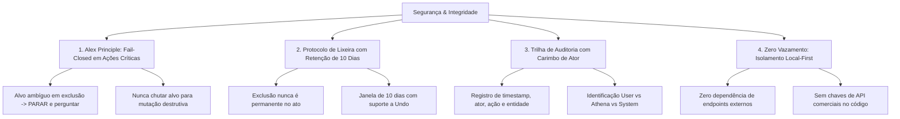

# Modelo de Segurança, Privacidade & Princípio Fail-Closed — VARYNTH OS

## 1. Visão Geral
A segurança no **VARYNTH OS** é orientada pelo princípio da **Soberania Absoluta e Não-Destrutibilidade Acidental**. O sistema não depende de servidores remotos para autenticação de dados de pesquisa, não expõe credenciais de usuários e trata qualquer operação destrutiva como reversível por padrão.

---

## 2. Pilares de Segurança



---

## 3. O Princípio de Alex (*Alex Principle*)
Em assistentes tradicionais, comandos imperativos vagos como *"apague isso"* ou *"exclua"* costumam adivinhar o recurso ativo, provocando perda de dados. No VARYNTH OS, aplica-se o **Alex Principle**:

> **Regra**: Se um comando de mutação ou exclusão contiver ambiguidade relevante quanto ao recurso de destino, o sistema **DEVE BLOQUEAR A EXECUÇÃO (*Fail-Closed*)** e solicitar confirmação explícita ao usuário.

### Exemplo de Aplicação:
- **Cenário**: Usuário digita *"exclua isso"* sem nenhuma entidade selecionada na tela.
- **Comportamento Bloqueado**: Athena **não** seleciona arbitrariamente o último projeto.
- **Comportamento Correto**: Athena solicita esclarecimento: *"Você se refere à tarefa 'X' ou ao projeto 'Y'?"*.

---

## 4. Política de Retenção de 10 Dias na Lixeira (`TrashManager`)
Nenhum recurso (projeto, tarefa, nota, obra do Vault, tese do Codex) é destruído instantaneamente do banco de dados local:
1. **Transição para Lixeira**: O item recebe `status: "lixeira"` e um timestamp de expiração (`expiresAt = Date.now() + 10 dias`).
2. **Capacidade de Desfazer (*Undo*)**: O usuário pode restaurar o item a qualquer momento dentro da janela de 10 dias, retornando ao estado original intacto.
3. **Purga Automática**: Somente itens que ultrapassarem os 10 dias de retenção são purgados na limpeza agendada.

---

## 5. Trilha de Auditoria & Não-Repúdio Local (`AuditTrail`)
Toda mutação executada registra um carimbo tipado na coleção de atividades (`src/lib/athena/tools/audit-trail.ts`):

```ts
export interface AuditRecord {
  id: string;
  timestamp: string;
  actor: "user" | "athena" | "system";
  action: string;
  targetType: "task" | "project" | "note" | "vault" | "codex" | "trash";
  targetId: string;
  details?: Record<string, unknown>;
  reversible: boolean;
}
```

Isso garante rastreabilidade total de quais tarefas foram criadas pela Athena versus quais foram adicionadas manualmente pelo usuário.

