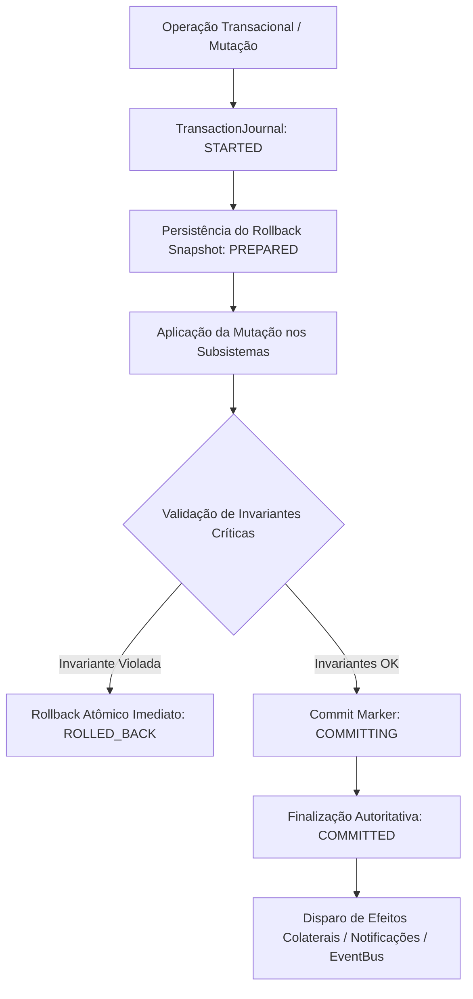

# Arquitetura de Hardening, Resiliência e Invariantes do Sistema (Creation Foundation — Fase 2)

## 1. Visão Geral e Princípio Fundamental

A Creation Foundation Fase 2 estabelece a camada de **System Hardening, Failure Recovery & Invariant Validation** do VARYNTH OS.

```text
FAILURE ≠ CORRUPTION
FAILURE + DETECTION + RECOVERY + INVARIANTS = RESILIENCE
```

O objetivo central desta fase não é adicionar funcionalidades criativas, mas provar e assegurar matematicamente e operacionalmente que o ecossistema VARYNTH permanece íntegro quando operações falham, são interrompidas, concorrem entre abas ou processos, esgotam recursos ou deixam estados parcialmente persistidos.



---

## 2. As 20 Invariantes Canônicas do Sistema (`INV-001` .. `INV-020`)

O VARYNTH OS formaliza 20 invariantes fundamentais com verificação em tempo de execução:

1. **`INV-001` (CRITICAL)**: *Published Artifact Dependency Immutability* — Um artefato publicado (`PUBLISHED`) nunca tem suas dependências alteradas silenciosamente ou em modo não pinado.
2. **`INV-002` (CRITICAL)**: *Authoritative Pinned Version Identity* — Toda dependência pinada resolve para um `targetVersionId` imutável e persistente.
3. **`INV-003` (HIGH)**: *Derived Asset Provenance Preservation* — Assets derivados preservam cadeia de proveniência apontando para o artefato de origem.
4. **`INV-004` (CRITICAL)**: *Completed Job Output Verification* — Um Job não pode estar em status `COMPLETED` sem outputs ou dados de resultado validados.
5. **`INV-005` (CRITICAL)**: *Physical Asset Storage Integrity* — Um Asset não pode ser reportado como `VALID` se seus dados binários estiverem ausentes ou corrompidos.
6. **`INV-006` (HIGH)**: *Restored Relationship Referential Integrity* — Nenhuma relação em artefato ativo pode apontar para um artefato inexistente.
7. **`INV-007` (HIGH)**: *Asset Usage Referential Integrity* — Nenhum `AssetUsageRecord` pode referenciar um asset inexistente no `AssetManager`.
8. **`INV-008` (CRITICAL)**: *Alex Principle Version Rollback Retention* — O rollback para uma versão anterior gera uma nova versão (`vNext`) sem deletar o histórico intermediário.
9. **`INV-009` (HIGH)**: *Logical and Physical Dependency Consistency* — A versão declarada na relação lógica e no `AssetUsageRecord` físico permanecem estritamente sincronizadas.
10. **`INV-010` (CRITICAL)**: *Atomic Dependency Update Rollback* — Falhas em atualizações de dependência nunca deixam mutações parciais persistidas.
11. **`INV-011` (CRITICAL)**: *Authorization Context Binding (Anti-TOCTOU)* — Tokens de confirmação da Athena são invalidados se a revisão ou parâmetros críticos forem alterados (`CONFIRMATION_STALE`).
12. **`INV-012` (CRITICAL)**: *Athena Hard Delete Prohibition* — Athena nunca possui autoridade para executar deleção permanente de dados (`DELETE_HARD`).
13. **`INV-013` (CRITICAL)**: *Sandbox Core Sovereign Boundary* — Execuções em Sandbox não possuem permissão de mutação direta sobre o Core soberano.
14. **`INV-014` (HIGH)**: *Build Artifact Version Association* — Todo job de build/renderização concluído referencia um artefato e versão válidos.
15. **`INV-015` (HIGH)**: *Historical Version Asset Retention* — Assets referenciados em versões históricas são protegidos contra garbage collection indevido.
16. **`INV-016` (MEDIUM)**: *Creative Graph Reverse Index Reconstructibility* — O índice reverso de dependentes é 100% reconstruível a partir dos relacionamentos autoritativos.
17. **`INV-017` (CRITICAL)**: *Stable Artifact Identity Through Trash and Restore* — O envio para a Lixeira e a Restauração preservam estritamente o mesmo ID imutável do artefato.
18. **`INV-018` (CRITICAL)**: *Backup Restore Physical Asset Verification* — A restauração de backup valida fisicamente a presença de bytes antes de reportar sucesso.
19. **`INV-019` (HIGH)**: *Published Output Manifest Preservation* — Outputs publicados preservam o manifesto de dependências capturado no momento da publicação.
20. **`INV-020` (CRITICAL)**: *Persistence Transparency and Fail-Closed* — O sistema nunca reporta sucesso ou estado "Salvo" se a escrita em storage falhar.

---

## 3. Transaction Journal & Recuperação de Inicialização

O `TransactionJournal` fornece durabilidade antes da mutação, prevenindo estados fantasmas mesmo em caso de crash repentino do navegador.

### Ciclo de Vida dos Estados Transacionais:
- **`STARTED`**: Operação registrada em storage durável antes do primeiro efeito colateral.
- **`PREPARED`**: Snapshot imutável de recuperação persistido.
- **`COMMITTING`**: Mutação aplicada; aguardando confirmação autoritativa.
- **`COMMITTED`**: Estado final consolidado com sucesso. Disparo de eventos e notificações liberado.
- **`ROLLING_BACK`**: Rollback em progresso com base no snapshot durável.
- **`ROLLED_BACK`**: Estado seguro restaurado; transação finalizada sem corrupção.
- **`FAILED`**: Transação abortada com diagnóstico e isolamento de falha.

---

## 4. Controle de Concorrência Otimista (OCC) e Anti-TOCTOU

1. **Separação entre Revisão Técnica e Versão Criativa**:
   - `revision`: Contador monotônico de controle de concorrência em cada escrita (`save(artifact, expectedRevision)`).
   - `ArtifactVersion`: Histórico criativo formal gerenciado pelo `VersionManager`.
2. **Hash Canônico de Autorização (Anti-TOCTOU)**:
   - Serialização canônica determinística independente da ordem de chaves em objetos JSON.
   - Vinculação estrita de token a: ação, domínio, ID do alvo, revisão esperada, versão esperada e parâmetros críticos da operação.
   - Qualquer mutação concorrente invalida o token com erro `CONFIRMATION_STALE`.

---

## 5. Isolamento de Recursos e Quarentena

- Assets com dados físicos corrompidos ou headers inválidos são transferidos para o status **`QUARANTINED`**.
- Um asset em quarentena é bloqueado imediatamente para qualquer novo render ou build, permitindo diagnóstico e inspeção sem contaminar a cadeia de produção criativa.

