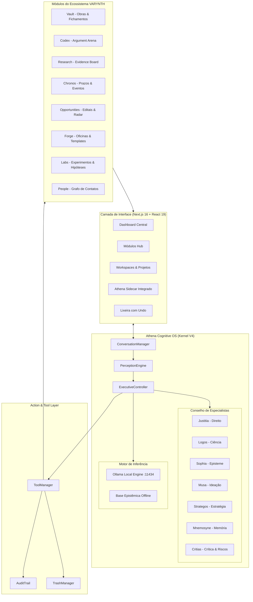

# Mapa do Sistema & Topologia de Subsistemas — VARYNTH OS

## 1. Topologia Macro do Ecossistema

---

## 2. Matriz de Componentes & Estado de Implementação

| Subsistema | Componente | Arquivo Principal | Status | Descrição |
| :--- | :--- | :--- | :--- | :--- |
| **Athena** | `ConversationManager` | `src/lib/athena/conversation/conversation-manager.ts` | `IMPLEMENTED` | Roteamento em 3 vias, anáforas e elipses |
| **Athena** | `PerceptionEngine` | `src/lib/athena/kernel/perception.ts` | `IMPLEMENTED` | Classificador estruturado de intenções e tarefas |
| **Athena** | `ExecutiveController` | `src/lib/athena/kernel/executive-controller.ts` | `IMPLEMENTED` | Orquestrador central cognitivo e orçamentário |
| **Athena** | `PersonaEngine` | `src/lib/athena/persona/persona-engine.ts` | `IMPLEMENTED` | Resposta direta, anti-evasão e diálogo substancial |
| **Athena** | `Council of Agents` | `src/lib/athena/agents/registry.ts` | `IMPLEMENTED` | 7 especialistas autônomos com deliberação consensual |
| **Athena** | `Action Layer / Tools` | `src/lib/athena/tools/tool-manager.ts` | `IMPLEMENTED` | 14 ferramentas determinísticas com Audit Trail |
| **Athena** | `OllamaAdapter` | `src/lib/athena/models/providers/ollama-adapter.ts` | `IMPLEMENTED` | Auto-detecção de modelo neural local (127.0.0.1:11434) |
| **Athena** | `EpistemicKnowledgeBase` | `src/lib/athena/knowledge/epistemic-concepts.ts` | `IMPLEMENTED` | Base embutida offline de Latim, Hermenêutica e Ciência |
| **Athena** | `Regression Suite` | `src/lib/athena/regression/regression-runner.ts` | `IMPLEMENTED` | 73 testes cobrindo 15 casos históricos de falhas reais |
| **VARYNTH** | `Workspaces/Projects` | `src/app/projects/page.tsx` | `IMPLEMENTED` | Gestão de workspaces com tarefas, notas e chat local |
| **VARYNTH** | `Trash (Lixeira)` | `src/app/modules/trash/page.tsx` | `IMPLEMENTED` | Retenção de 10 dias com suporte a Desfazer e auto-purge |
| **VARYNTH** | `Vault` | `src/app/modules/vault/page.tsx` | `IMPLEMENTED` | Catálogo de conhecimento, autores e status de leitura |
| **VARYNTH** | `Codex` | `src/app/modules/codex/page.tsx` | `IMPLEMENTED` | Argument Arena, controvérsias e matriz de precedentes |
| **VARYNTH** | `Research` | `src/app/modules/research/page.tsx` | `IMPLEMENTED` | Evidence Board com força probatória e fontes primárias |
| **VARYNTH** | `Chronos` | `src/app/modules/chronos/page.tsx` | `IMPLEMENTED` | Linha do tempo, prazos processuais e marcos de entrega |
| **VARYNTH** | `Labs` | `src/app/modules/labs/page.tsx` | `IMPLEMENTED` | Incubadora de ideias preliminares e hipóteses práticas |
| **VARYNTH** | `Forge` | `src/app/modules/forge/page.tsx` | `IMPLEMENTED` | Oficina digital de prototipagem e modelos operacionais |
| **VARYNTH** | `Opportunities` | `src/app/modules/opportunities/page.tsx` | `IMPLEMENTED` | Radar de bolsas, editais acadêmicos e parcerias |
| **VARYNTH** | `People` | `src/app/modules/people/page.tsx` | `IMPLEMENTED` | Grafo relacional de pesquisadores e colaboradores |
| **VARYNTH** | `Activity / Audit` | `src/app/modules/activity/page.tsx` | `IMPLEMENTED` | Linha do tempo de mutações com identificação de ator |
| **VARYNTH** | `P2P Sync Criptografado`| - | `PLANNED` | Sincronização multi-dispositivo sem nuvem central |
| **VARYNTH** | `Vector Store Nativo` | - | `PLANNED` | Embeddings em WASM/Rust para busca semântica offline |
