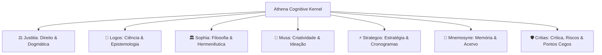

# Conselho de Especialistas Cognitivos — Athena

## 1. Visão Geral
O **Conselho de Especialistas** (`Council of Agents`) é a estrutura de inteligência multiagente da Athena (`src/lib/athena/agents/`). Em vez de depender de uma persona genérica monolítica, a Athena ativa especialistas com competências e manifestos formais dedicados a cada domínio do saber.

---

## 2. Os 7 Especialistas do Conselho

---

## 3. Ficha Técnica dos Agentes

| Agente | Arquivo | Papel & Especialidade | Quando é Ativado |
| :--- | :--- | :--- | :--- |
| **Justitia** | `council/justitia.ts` | Análise jurídica, dogmática, precedentes vinculantes e teses STF/STJ | Tarefas `LEGAL_ANALYSIS`, consultas de jurisprudência |
| **Logos** | `council/logos.ts` | Método científico, evidências empíricas e síntese bibliográfica | Tarefas `RESEARCH_SYNTHESIS`, Evidence Board |
| **Sophia** | `council/sophia.ts` | Hermenêutica profunda, epistemologia e fundamentos conceituais | Tarefas `EPISTEMIC_INQUIRY`, dúvidas filosóficas |
| **Musa** | `council/musa.ts` | Ideação criativa, propostas disruptivas e incubação no Labs | Pedidos de `BRAINSTORM`, novas perspectivas |
| **Strategos** | `council/strategos.ts` | Viabilidade operacional, priorização e prazos no Chronos | Pedidos de `RECOMMEND`, planejamento de projetos |
| **Mnemosyne** | `council/mnemosyne.ts` | Recuperação de conhecimento, acervo do Vault e conexões | Buscas no Vault e recuperação de contexto antigo |
| **Critias** | `council/critias.ts` | Identificação de pontos cegos, riscos metodológicos e mitigação | Tarefas `CRITIQUE`, revisões de consistência |
