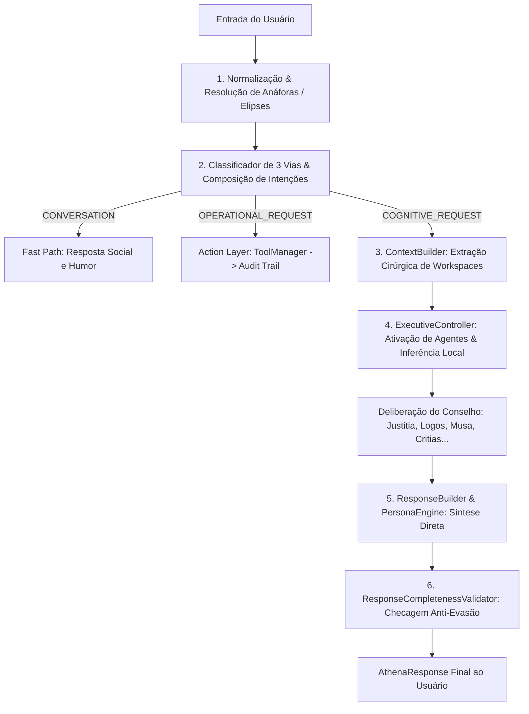

# Arquitetura Cognitiva da Athena — Pipeline & Execução

## 1. Visão Geral
A arquitetura da **Athena** foi desenhada para superar as limitações de agentes puramente baseados em strings de prompt. Ela é dividida em **etapas desacopladas de processamento**: Percepção, Roteamento em 3 Vias, Resolução de Contexto, Deliberação de Conselho, Validação de Completude e Execução de Ferramentas.

---

## 2. Pipeline de Processamento Cognitivo

---

## 3. As Três Vias de Execução

1. **`CONVERSATION` (Fast Path)**:
   - **Objetivo**: Diálogo casual, saudações (*"Olá"*, *"Bom dia"*), desabafos e humor (*"kkkk"*).
   - **Comportamento**: Resposta natural imediata (0 ms), sem disparar queries desnecessárias a banco de dados nem relatórios.

2. **`COGNITIVE_REQUEST` (Cognitive Path)**:
   - **Objetivo**: Ideação de projetos (`BRAINSTORM`), recomendações (`RECOMMEND`), análises (`ANALYZE`), comparações (`COMPARE`), críticas (`CRITIQUE`), explicações conceituais (`EXPLAIN`) e planejamento (`PLAN`).
   - **Comportamento**: Aciona o conselho de especialistas e entrega resposta direta com fundamentação substancial.

3. **`OPERATIONAL_REQUEST` (Operational Path)**:
   - **Objetivo**: Mutações no estado do sistema (*"Crie uma tarefa"*, *"Mova para a lixeira"*, *"Crie uma nota"*).
   - **Comportamento**: Execução determinística via `ToolManager`, aplicação do *Alex Principle* em ambiguidades e carimbo no `AuditTrail`.
