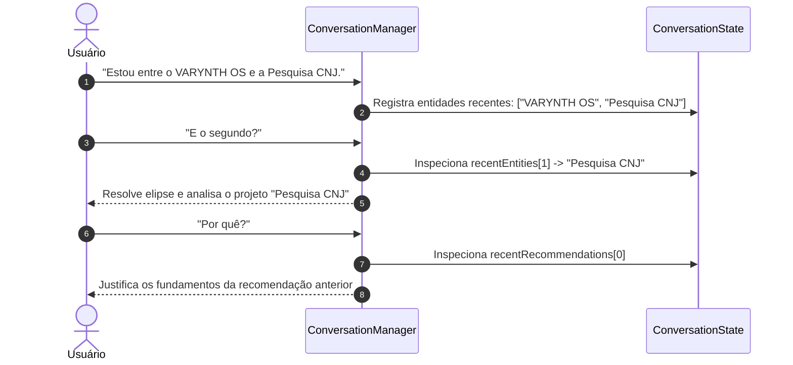

# Conversation Manager & Resolução Contextual — Athena

## 1. Visão Geral
O **`ConversationManager`** (`src/lib/athena/conversation/conversation-manager.ts`) é o motor de compreensão contextual multi-turno da Athena. Ele substitui a antiga correspondência estática de strings por uma análise semântica que avalia o histórico recente, entidades ativas e elipses antes de emitir a classificação final de intenções.

---

## 2. Estrutura do Contexto Resolvido (`ParsedCognitiveContext`)

```ts
export interface ParsedCognitiveContext {
  interactionType: "CONVERSATION" | "COGNITIVE_REQUEST" | "OPERATIONAL_REQUEST";
  intents: CognitiveIntent[];
  subject?: string;
  temporalContext?: "TODAY" | "THIS_WEEK" | "FUTURE" | "PAST" | "NONE";
  confidence: "HIGH" | "MEDIUM" | "LOW";
  requiresContext: boolean;
  requiresAction: boolean;
  resolvedEntities: {
    targetProjectId?: string;
    targetProjectTitle?: string;
    referencedEntityName?: string;
    pronounTarget?: "ATHENA" | "USER_SYSTEM" | "SPECIFIC_PROJECT" | "GENERAL";
  };
  ellipsisResolved?: {
    isEllipsis: boolean;
    originalReferent?: string;
    resolvedMeaning?: string;
  };
  isAmbiguous: boolean;
}
```

---

## 3. Resolução de Anáforas e Elipses Conversacionais

O `ConversationManager` é capaz de compreender respostas curtas que dependem do contexto de turnos anteriores:



---

## 4. Distinção de Alvos Pronominais
O sistema distingue automaticamente quem é o sujeito da pergunta:
- *"Como você está?"* ➔ Alvo: **`ATHENA`** (Diálogo social, Fast Path).
- *"Como está meu sistema?"* ➔ Alvo: **`USER_SYSTEM`** (Consulta focada a tarefas e projetos).
- *"Como está seu Kernel?"* ➔ Alvo: **`ATHENA`** (Diagnóstico técnico dos subsistemas cognitivos).
- *"Como está aquele projeto?"* ➔ Alvo: **`SPECIFIC_PROJECT`** (Status da workspace referenciada).
