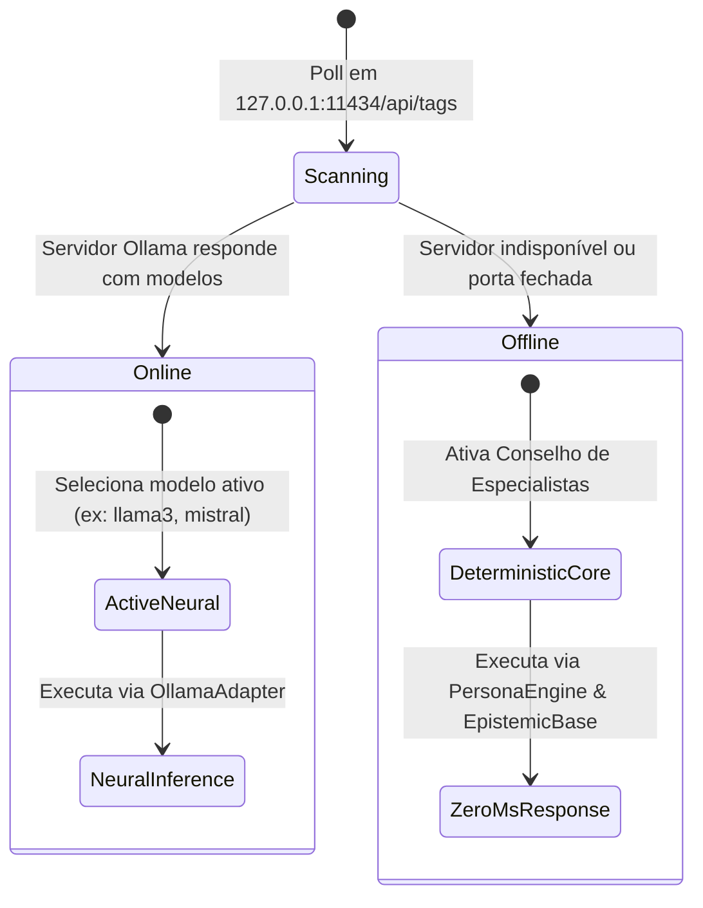

# Modelos Locais & Adaptador Ollama — Athena

## 1. Visão Geral
A integração de modelos neurais na Athena é regida pelo contrato abstrato **`LLMAdapter`** (`src/lib/athena/models/adapter.ts`). O sistema suporta inferência neural local através do Ollama (rodando em `http://127.0.0.1:11434`), mantendo total independência de fornecedores e preservando o baseline determinístico caso nenhum servidor local esteja ativo.

---

## 2. Detecção Automática e Ciclo de Vida



---

## 3. Contrato de Abstração (`LLMAdapter`)
O Kernel da Athena interage exclusivamente com a interface:

```ts
export interface LLMAdapter {
  id: string;
  name: string;
  isAvailable(): Promise<boolean>;
  generate(request: ModelRequest): Promise<ModelResponse>;
}
```

Isso garante que futuros adaptadores (ex: llama.cpp nativo em WASM, ONNX Runtime, WebGPU) possam ser adicionados sem alterar uma única linha do `ExecutiveController`.
