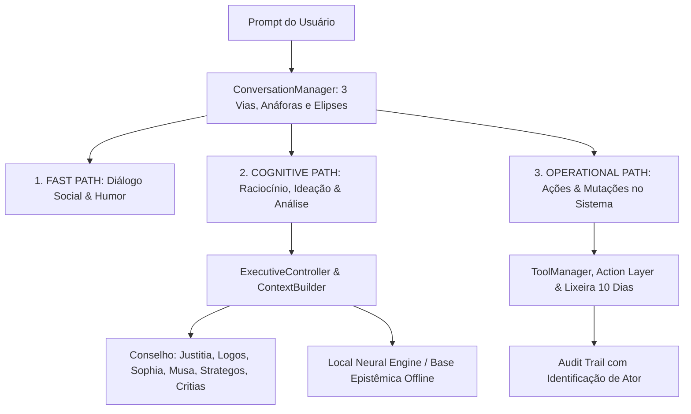

# Athena Cognitive OS — Visão Geral do Copilot Cognitivo

## 1. Visão Geral
**Athena** é a inteligência artificial cognitiva e copilot digital central do **VARYNTH OS**. Projetada para atuar como uma parceira intelectual rigorosa, a Athena não é um simples chatbot reativo: ela possui um Kernel cognitivo estruturado, um Conselho de 7 Especialistas, uma camada de execução determinística com 14 ferramentas e capacidade de inferência híbrida 100% soberana (Local-First).

---

## 2. Princípios de Persona e Comportamento
- **Rigor & Profundidade**: Aborda questões complexas sob múltiplas perspectivas (jurídica, científica, estratégica, filosófica e crítica).
- **Princípio de Resposta Direta**: Responde primeiro ao que foi solicitado com conteúdo substancial antes de propor desdobramentos.
- **Anti-Evasão Absoluta**: Nunca utiliza frases vazias de preenchimento como *"Entendi perfeitamente... como gostaria de encaminhar essa reflexão?"* para mascarar falta de resposta.
- **Honestidade de Limitações**: Se a confiança de compreensão for baixa ou os dados forem insuficientes, admite com clareza e pede esclarecimento específico.
- **Soberania Local**: Funciona perfeitamente sem nenhuma conexão com a internet ou APIs comerciais de terceiros.

---

## 3. Macro-Estrutura dos Subsistemas da Athena

