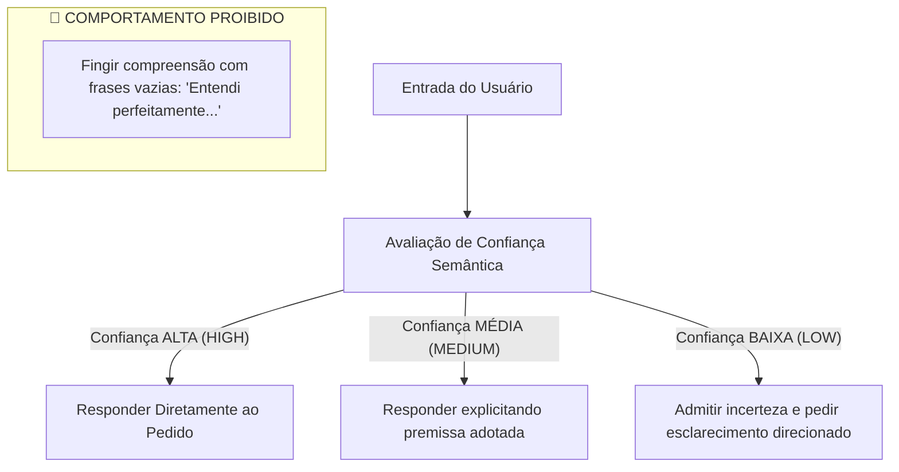

# Segurança Conversacional, Anti-Evasão & Honestidade — Athena

## 1. Visão Geral
A Athena implementa um conjunto rigoroso de **Guardrails Conversacionais** e **Quality Gates** (`src/lib/athena/conversation/completeness-validator.ts` e `src/lib/athena/conversation/telemetry.ts`) para garantir que o assistente seja intelectualmente honesto, direto e confiável.

---

## 2. Política de Honestidade de Compreensão

---

## 3. Validador de Completude da Resposta (`ResponseCompletenessValidator`)
Antes de liberar qualquer resposta de requisição cognitiva (`COGNITIVE_REQUEST`):
1. Se o usuário solicitou **Ideias** (`BRAINSTORM`), o validador confere se há propostas numeradas no texto.
2. Se o usuário solicitou **Recomendação** (`RECOMMEND`), confere se há indicação clara da melhor opção de início.
3. Se o usuário solicitou **Crítica** (`CRITIQUE`), confere se foram apontados riscos e pontos cegos.
4. Se o texto contiver frases de evasão ou tiver menos de 30 caracteres para uma análise densa, a resposta é reprovada e re-sintetizada.

---

## 4. Telemetria Local de Falhas (`LocalFailureTelemetry`)
Qualquer evento de baixa confiança (`LOW_CONFIDENCE`), necessidade de esclarecimento (`CLARIFICATION_REQUIRED`) ou resposta incompleta (`INCOMPLETE_RESPONSE`) é registrado internamente em memória para depuração técnica offline, sem envio para servidores de terceiros.
