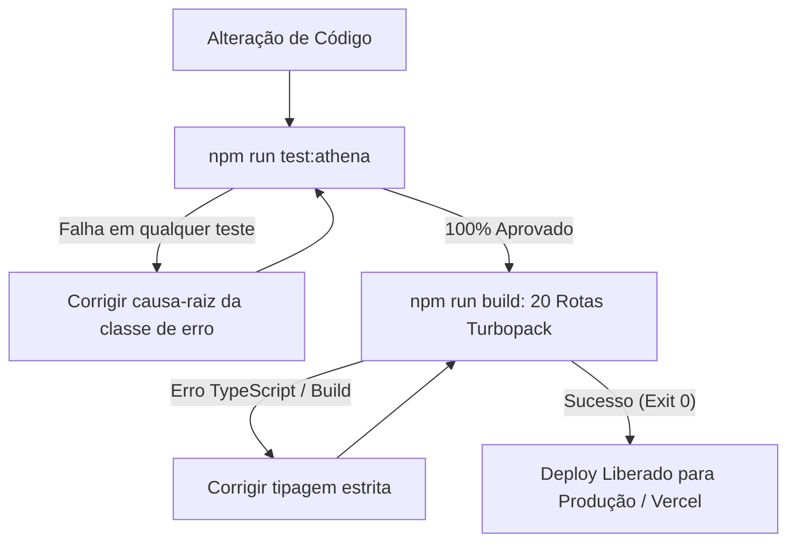

# Estratégia de Testes & Quality Gates — VARYNTH OS

## Gate documental obrigatório

Antes de considerar uma mudança concluída, execute `npm run test:docs:regression`. O teste deriva o inventário mínimo do checkout e falha quando rotas, módulos, ferramentas ou agentes mudam sem revisão das âncoras documentais, ou quando princípios soberanos deixam de estar descobertos. Ele não substitui revisão humana de conteúdo.

Para validação completa antes de integrar ou publicar, execute `npm run test:all`. O comando agrega gates de documentação, segurança, persistência, backup, jobs, sandbox, studios, orquestração e Athena. O build continua sendo uma validação separada de compilação e pré-renderização.

## 1. Visão Geral
O VARYNTH OS adota uma política estrita de **Bloqueio de Regressão**: nenhuma alteração de código ou refatoração é considerada concluída se quebrar casos históricos reais ou falhar na verificação de tipagem estrita do Next.js.

---

## 2. Comandos de Teste Disponíveis

```bash
# Executa a Suíte Histórica de Regressão Conversacional (73 testes)
npm run test:athena:regression

# Executa os testes de diálogo e classificação rápida
npm run test:athena:conversation

# Executa o gate documental
npm run test:docs:regression

# Executa a validação de compilação das rotas atuais; o prebuild também roda o gate documental
npm run build
```

---

## 3. Fluxo de Validação Pré-Deploy


