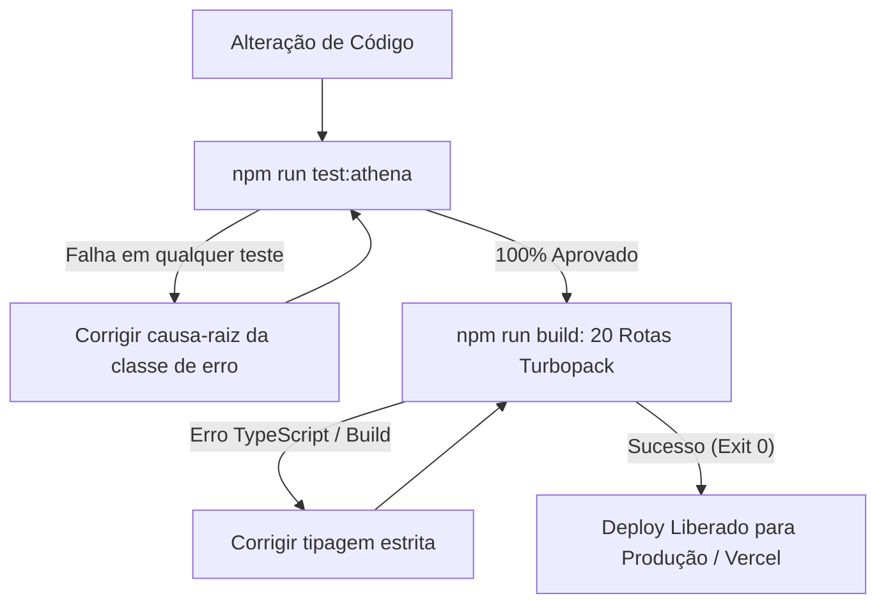

# Estratégia de Testes & Quality Gates — VARYNTH OS

## 1. Visão Geral
O VARYNTH OS adota uma política estrita de **Bloqueio de Regressão**: nenhuma alteração de código ou refatoração é considerada concluída se quebrar casos históricos reais ou falhar na verificação de tipagem estrita do Next.js.

---

## 2. Comandos de Teste Disponíveis

```bash
# Executa a Suíte Histórica de Regressão Conversacional (73 testes)
npm run test:athena:regression

# Executa os testes de diálogo e classificação rápida
npm run test:athena:conversation

# Executa todos os testes e quality gates
npm run test:athena

# Executa a validação de compilação de todas as 20 rotas Next.js 16
npm run build
```

---

## 3. Fluxo de Validação Pré-Deploy



