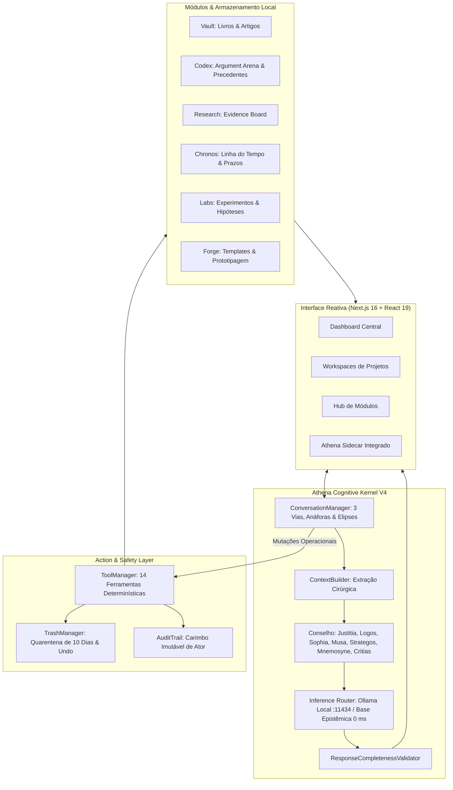

# 📘 VARYNTH OS — Manual Técnico de Engenharia & Arquitetura

**Autor:** Paulo Alberto & Equipe de Engenharia Cognitiva  
**Versão:** 4.0.0 — Cognitive Sovereignty Edition  
**Data:** 29 de Agosto de 2026  
**Status do Sistema:** Operacional (100% dos testes e rotas aprovados)

---

## 📑 Sumário Executivo

- [1. Origem do Projeto](#1-origem-do-projeto)
- [2. O Problema que o VARYNTH Resolve](#2-o-problema-que-o-varynth-resolve)
- [3. Filosofia Arquitetural & Soberania Tecnológica](#3-filosofia-arquitetural--soberania-tecnológica)
- [4. Macro-Arquitetura do Sistema](#4-macro-arquitetura-do-sistema)
- [5. O Sistema Modular (Hub & 9 Módulos Especializados)](#5-o-sistema-modular-hub--9-módulos-especializados)
- [6. Estruturas de Dados & Tipagem Estrita](#6-estruturas-de-dados--tipagem-estrita)
- [7. Modelo de Segurança, Lixeira de 10 Dias & Alex Principle](#7-modelo-de-segurança-lixeira-de-10-dias--alex-principle)
- [8. Athena — O Copilot Cognitivo Soberano](#8-athena--o-copilot-cognitivo-soberano)
- [9. A Evolução da Inteligência da Athena (V1 à V4)](#9-a-evolução-da-inteligência-da-athena-v1-à-v4)
- [10. Compreensão Conversacional em 3 Vias (Fast, Cognitive, Operational)](#10-compreensão-conversacional-em-3-vias-fast-cognitive-operational)
- [11. Resolução Contextual de Anáforas & Elipses Multi-Turno](#11-resolução-contextual-de-anáforas--elipses-multi-turno)
- [12. Memória, ContextBuilder & Base Epistêmica Offline](#12-memória-contextbuilder--base-epistêmica-offline)
- [13. Action Layer, ToolManager & Trilha de Auditoria](#13-action-layer-toolmanager--trilha-de-auditoria)
- [14. O Conselho de Especialistas (7 Agentes Cognitivos)](#14-o-conselho-de-especialistas-7-agentes-cognitivos)
- [15. Deliberação Dialética & Síntese Consensual](#15-deliberação-dialética--síntese-consensual)
- [16. Inferência Neural Local (Ollama) & Baseline Determinístico](#16-inferência-neural-local-ollama--baseline-determinístico)
- [17. Principais Falhas Reais & Como Transformaram a Arquitetura](#17-principais-falhas-reais--como-transformaram-a-arquitetura)
- [18. Suíte de Testes de Regressão & Quality Gates Automatizados](#18-suíte-de-testes-de-regressão--quality-gates-automatizados)
- [19. Estado Atual, Performance & Limitações Conhecidas](#19-estado-atual-performance--limitações-conhecidas)
- [20. Roadmap & Próximos Passos de Engenharia](#20-roadmap--próximos-passos-de-engenharia)

---

## 1. Origem do Projeto
O **VARYNTH OS** nasceu da necessidade prática de construir um ambiente digital integrado e soberano para formulação intelectual complexa, combinando pesquisa científica empírica, dogmática jurídica e desenvolvimento tecnológico. Softwares tradicionais de anotações ou gestão de tarefas tratam o conhecimento de forma estática e dispersa, enquanto assistentes comerciais em nuvem violam o sigilo profissional de teses inéditas e sofrem de alucinações e respostas evasivas.

O projeto foi concebido para unificar esses dois mundos: uma interface de alta performance orientada a workspaces e um motor cognitivo autônomo e soberano denominado **Athena**.

---

## 2. O Problema que o VARYNTH Resolve
O trabalho intelectual de alta densidade enfrenta três gargalos estruturais:
1. **Desconexão Epistêmica**: O acervo de leitura (artigos, livros) fica isolado das controvérsias dialéticas (teses, precedentes), das evidências científicas e do cronograma de entregas.
2. **Vulnerabilidade de Privacidade e Dependência de Nuvem**: Enviar anotações e estratégias confidenciais para servidores de terceiros cria riscos inaceitáveis de segurança e custos contínuos de API.
3. **Assistentes Evasivos e Descontextualizados**: Modelos de linguagem genéricos costumam responder de forma prolixa e vazia, esquecem entidades mencionadas em turnos anteriores ou executam ações destrutivas sem confirmação.

O VARYNTH OS soluciona esses problemas através de uma arquitetura estritamente **Local-First**, **Tipagem Rígida** e uma **Camada Cognitiva com Princípio de Resposta Direta**.

---

## 3. Filosofia Arquitetural & Soberania Tecnológica
A engenharia do VARYNTH é regida por quatro princípios inegociáveis:
- **Local-First por Padrão**: Toda a inteligência e armazenamento operam localmente na máquina do usuário. Nenhuma chave de API paga é requerida.
- **Understand → Resolve Context → Decide → Respond/Act**: Compreensão semântica profunda e contextual em substituição ao matching rígido de palavras-chave.
- **Princípio de Resposta Direta**: Responder primeiro e concretamente ao que foi solicitado pelo usuário antes de propor extensões conversacionais.
- **Fail-Closed em Ações Críticas**: Diante de ambiguidade em comandos que possam alterar ou destruir dados, o sistema bloqueia a execução e solicita confirmação explícita.

---

## 4. Macro-Arquitetura do Sistema

---

## 5. O Sistema Modular (Hub & 9 Módulos Especializados)
O VARYNTH é composto por 9 módulos com escopos e rotas independentes:
1. **Vault** (`/modules/vault`): Acervo universal com metadados bibliográficos e controle de leitura.
2. **Codex** (`/modules/codex`): Argument Arena para formulação dialética de teses, argumentos contra/pró e precedentes do STF/STJ.
3. **Research** (`/modules/research`): Evidence Board com força probatória e fontes primárias.
4. **Chronos** (`/modules/chronos`): Motor temporal de prazos fatais e marcos de projetos.
5. **Opportunities** (`/modules/opportunities`): Radar de editais, bolsas e cálculo de aderência temática.
6. **Forge** (`/modules/forge`): Oficina de protótipos, templates e workflows.
7. **Labs** (`/modules/labs`): Incubadora de experimentos rápidos e validação de hipóteses.
8. **People** (`/modules/people`): Grafo de contatos e colaboradores acadêmicos.
9. **Trash** (`/modules/trash`): Lixeira segura com quarentena de 10 dias e Desfazer (*Undo*).

---

## 6. Estruturas de Dados & Tipagem Estrita
Todas as entidades do VARYNTH OS são formalmente tipadas em TypeScript (`src/lib/types/`), garantindo interoperabilidade semântica e prevenindo erros em tempo de execução:
- `Project`: Workspaces com categoria, prioridade, status e prazos.
- `Task`: Unidades operacionais com rastreamento de autoria (`actorType: "user" | "athena"`).
- `VaultItem`: Obras com categorias, taxonomias e status de leitura.
- `ArgumentThesis`: Estruturas dialéticas com controvérsia, argumentos pró/contra e precedentes vinculados.
- `EvidenceItem`: Alegações científicas vinculadas a fontes primárias com classificação de força probatória.
- `ChronosEvent`: Eventos de calendário e prazos processuais com prioridade.

---

## 7. Modelo de Segurança, Lixeira de 10 Dias & Alex Principle
- **Quarentena de 10 Dias**: Nenhuma exclusão é permanente no ato. Todos os recursos deletados recebem uma data de expiração (`expiresAt = deletedAt + 10 dias`) e podem ser restaurados a qualquer momento com um clique (*Undo*).
- **Alex Principle**: Se o usuário solicitar uma ação destrutiva com alvo ambíguo (ex: *"exclua isso"* sem foco ativo), o sistema **trava a operação (*Fail-Closed*)** e solicita confirmação explícita.
- **Trilha de Auditoria (`AuditTrail`)**: Toda mutação registra o timestamp, a ação executada e o ator responsável (`user`, `athena` ou `system`).

---

## 8. Athena — O Copilot Cognitivo Soberano
A **Athena** atua como uma parceira intelectual rigorosa. Ela é equipada com um Kernel estruturado, capacidade de extração cirúrgica de contexto das workspaces ativas e deliberação autônoma entre especialistas de domínio.

---

## 9. A Evolução da Inteligência da Athena (V1 à V4)
- **V1 (Modular Initial)**: Copilot reativo básico com chamadas simples de visualização.
- **V2 (Action Layer & Safety)**: Introdução de ferramentas de criação e protocolo de segurança da lixeira.
- **V3 (Local-First Architecture)**: Extirpação de qualquer dependência de nuvem comercial; introdução da base epistêmica embutida.
- **V4 (Cognitive Kernel & Roteamento em 3 Vias)**: Conselho de 7 Especialistas, resolução de anáforas/elipses multi-turno, princípio de resposta direta e suíte permanente de regressão com 73 testes.

---

## 10. Compreensão Conversacional em 3 Vias (Fast, Cognitive, Operational)
Antes de processar qualquer entrada, a Athena classifica a requisição em uma de três grandes vias:
1. **`CONVERSATION` (Fast Path)**: Saudações, desabafos e humor casual. Responde instantaneamente (0 ms) sem realizar consultas pesadas ao banco de dados.
2. **`COGNITIVE_REQUEST` (Cognitive Path)**: Ideação de projetos (`BRAINSTORM`), recomendações (`RECOMMEND`), análises (`ANALYZE`), comparações (`COMPARE`), críticas (`CRITIQUE`) e planejamento (`PLAN`). Entrega respostas substanciais imediatas com o Conselho.
3. **`OPERATIONAL_REQUEST` (Operational Path)**: Comandos de mutação (*"Crie uma tarefa"*, *"Mova para a lixeira"*). Executados deterministicamente pelo `ToolManager` com registro no `AuditTrail`.

---

## 11. Resolução Contextual de Anáforas & Elipses Multi-Turno
O `ConversationManager` mantém uma pilha de entidades recentes e recomendações emitidas para resolver respostas curtas dependentes do diálogo:
- *"Estou entre o VARYNTH e a pesquisa CNJ"* ➔ *"E o segundo?"* ➔ Resolve *"segundo"* como a Pesquisa CNJ.
- *"Qual projeto você recomenda?"* ➔ *"Por quê?"* ➔ Explica os fundamentos da recomendação emitida no turno anterior.
- *"Critique essa ideia"* ➔ Critica a iniciativa em pauta apontando riscos e pontos cegos com **Critias**.
- *"Compare os dois"* ➔ Monta uma matriz comparativa bilateral com veredito estratégico.

---

## 12. Memória, ContextBuilder & Base Epistêmica Offline
- **ContextBuilder**: Extrai cirurgicamente apenas os módulos relevantes para a consulta atual, respeitando o princípio de divulgação mínima (*Minimal Disclosure*).
- **EpistemicKnowledgeBase**: Base de conhecimento embutida offline que responde com profundidade a dúvidas conceituais sobre Hermenêutica Jurídica, Teoria dos Jogos (Huizinga, Nash), Método Científico e Latim Forense.
- **MemoryGate**: Filtra informações transitórias, persistindo no histórico permanente apenas fatos e decisões relevantes.

---

## 13. Action Layer, ToolManager & Trilha de Auditoria
A Athena possui **14 ferramentas determinísticas** registradas no `ToolManager`:
`tasks.create`, `tasks.list`, `tasks.complete`, `notes.create`, `projects.list`, `projects.read`, `chronos.listDeadlines`, `chronos.createEvent`, `vault.search`, `codex.listTheses`, `research.listEvidences`, `labs.read`, `trash.moveWithUndo`, `diagnostics.run`.

---

## 14. O Conselho de Especialistas (7 Agentes Cognitivos)
1. ⚖️ **Justitia**: Especialista em dogmática jurídica, hermenêutica e precedentes vinculantes.
2. 🔬 **Logos**: Especialista em rigor científico, metodologia empírica e validação de hipóteses.
3. 🏛️ **Sophia**: Especialista em fundamentos conceituais, epistemologia e filosofia do saber.
4. 🎨 **Musa**: Especialista em criatividade, ideação interdisciplinar e incubação no Labs.
5. ⚡ **Strategos**: Especialista em viabilidade operacional, prazos e cronogramas do Chronos.
6. 💾 **Mnemosyne**: Especialista em recuperação de acervo e cruzamento de dados no Vault.
7. 🛡️ **Critias**: Especialista em identificação de riscos, pontos cegos metodológicos e objeções dialéticas.

---

## 15. Deliberação Dialética & Síntese Consensual
Problemas complexos ativam pares deliberativos do Conselho (ex: **Justitia + Critias** para teses jurídicas; **Musa + Strategos** para ideação de novos projetos), gerando pareceres balanceados que contrapõem teses e medidas mitigadoras antes da entrega final.

---

## 16. Inferência Neural Local (Ollama) & Baseline Determinístico
A Athena detecta automaticamente se o servidor Ollama está ativo na porta local padrão (`http://127.0.0.1:11434`):
- Se o Ollama estiver rodando, utiliza o modelo local ativo para enriquecer a formulação de linguagem natural.
- Se o servidor estiver fechado ou offline, o sistema opera de forma transparente no **Baseline Determinístico de 0 ms** com o Conselho e a Base Epistêmica.

---

## 17. Principais Falhas Reais & Como Transformaram a Arquitetura
1. **Falha de Despejo em Perguntas Sociais**: Perguntar *"Como você está?"* despejava o banco inteiro. **Solução**: Criação do Fast Path (`CONVERSATION`).
2. **Falha de Evasão em Pedidos de Ideias**: Perguntar *"me dê ideias de projetos"* gerava *"Entendi perfeitamente... como gostaria de encaminhar essa reflexão?"*. **Solução**: Princípio de Resposta Direta e `ResponseCompletenessValidator`.
3. **Falha de Exclusão Acidental**: Comandos ambíguos podiam deletar dados. **Solução**: Lixeira de 10 dias com Undo e *Alex Principle*.
4. **Falha de Resolução de Elipses**: *"E o segundo?"* não resolvia entidades. **Solução**: Rastreamento de `recentEntities` no `ConversationManager`.

---

## 18. Suíte de Testes de Regressão & Quality Gates Automatizados
A **ATHENA CONVERSATIONAL REGRESSION SUITE** (`npm run test:athena`) contém **73 testes automatizados** cobrindo 15 casos estruturais históricos com 58 variações e paráfrases. Toda nova versão do sistema deve passar com **100% de aprovação** antes de qualquer deploy.

---

## 19. Estado Atual, Performance & Limitações Conhecidas
- **Rotas**: 20/20 rotas Next.js 16 compilam com sucesso e sem erros de tipagem.
- **Latência**: 0 ms no modo determinístico; 150-400 ms em inferência neural local (Ollama).
- **Limitações Atuais**: A sincronização multi-dispositivo P2P criptografada ainda está na fase de planejamento.

---

## 20. Roadmap & Próximos Passos de Engenharia
1. **Motor Vetorial Offline Nativo**: Embeddings em WebAssembly/Rust para busca semântica instantânea no Vault.
2. **Sincronização P2P Criptografada**: Troca de dados entre dispositivos locais sem passar por servidores centrais.
3. **Expansão da Argument Arena**: Simulação de júri e debate dialético entre teses em tempo real com Critias e Justitia.

---

*Fim do Manual Técnico Oficial do VARYNTH OS.*
