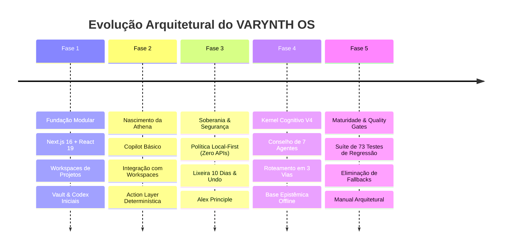

# Linha do Tempo da Engenharia — VARYNTH OS

## 1. Visão Geral
Esta linha do tempo registra a evolução da engenharia do VARYNTH OS, documentando a transição de uma plataforma modular inicial até a consolidação de um ecossistema cognitivo soberano com a Athena.

---

## 2. Linha do Tempo de Engenharia

---

## 3. Resumo das Fases

1. **Fase 1 (Fundação Modular)**: Criação das 20 rotas em Next.js 16 com Turbopack e Tailwind v4, estabelecendo os módulos de conhecimento (Vault, Codex, Research, Chronos).
2. **Fase 2 (Nascimento da Athena)**: Criação do copilot com Perception Engine e Action Layer para criar tarefas e notas.
3. **Fase 3 (Soberania & Segurança)**: Definição da arquitetura Local-First (ADR-001) e proteção contra exclusão acidental via Lixeira de 10 dias (ADR-002).
4. **Fase 4 (Kernel Cognitivo V4)**: Implementação do Conselho de 7 especialistas (Justitia, Logos, Sophia, Musa, Strategos, Mnemosyne, Critias), Base Epistêmica e Auto-detecção do Ollama local.
5. **Fase 5 (Maturidade & Quality Gates)**: Roteamento em 3 vias, eliminação de frases evasivas, criação da suíte permanente de regressão (73 testes) e manual arquitetural oficial.

