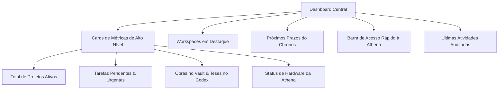

# Dashboard Central & Cockpit Executivo — VARYNTH OS

## 1. Visão Geral
O **Dashboard** (`/dashboard`) funciona como a torre de controle integrada do VARYNTH OS, consolidando em uma única tela métricas de produtividade, marcos temporais iminentes no Chronos, distribuição de projetos ativos e acesso imediato ao copilot cognitivo.

---

## 2. Componentes e Widgets do Cockpit

---

## 3. Dinâmica de Atualização
- **Reatividade Local**: O dashboard lê os dados locais consolidados do ecossistema e recalcula agregações instantaneamente sem requisições HTTP redundantes.
- **Minimal Disclosure**: Mostra indicadores estratégicos e destaca apenas os 3 prazos mais próximos para evitar sobrecarga cognitiva.

