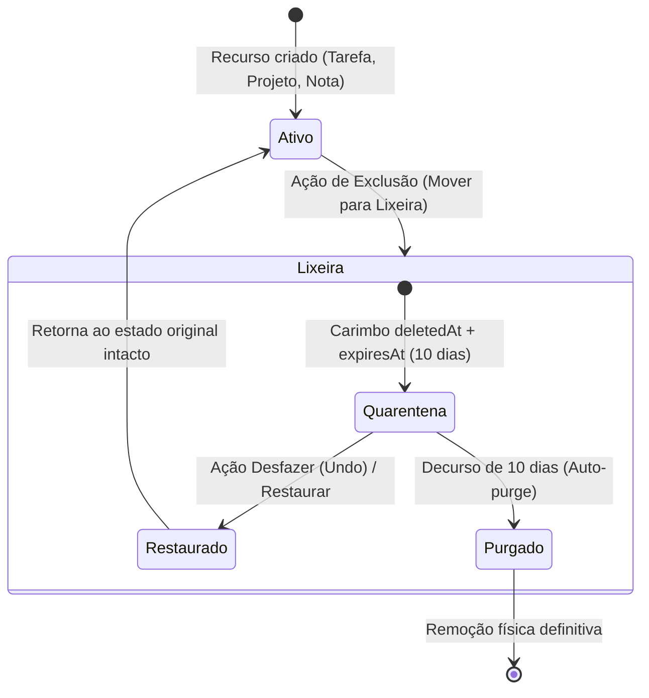

# Lixeira & Protocolo de Retenção de 10 Dias — VARYNTH OS

## 1. Visão Geral
O módulo de **Lixeira** (`/modules/trash`) implementa a política de segurança contra destruição acidental de dados. No VARYNTH OS, nenhuma ação de exclusão promovida pelo usuário ou pela Athena apaga dados imediatamente. Todos os itens excluídos entram em quarentena com prazo de retenção de **10 dias** e suporte total a **Desfazer (*Undo*)**.

---

## 2. Estrutura de Dados do Item em Quarentena (`TrashItem`)

```ts
export type TrashItemType = "projeto" | "tarefa" | "nota" | "vault" | "codex" | "research" | "opportunity" | "forge" | "lab";

export interface TrashItem {
  id: string;
  originalId: string;
  type: TrashItemType;
  title: string;
  deletedAt: string;
  expiresAt: string; // deletedAt + 10 dias
  originalData: Record<string, unknown>;
  deletedBy: "user" | "athena" | "system";
  restored: boolean;
}
```

---

## 3. Fluxo de Exclusão e Restauração



---

## 4. O Princípio de Confirmação em Alvos Ambíguos
Se o usuário solicitar à Athena *"apague isso"* ou *"exclua"* sem que haja um item inequivocamente selecionado, a Athena **não adivinha** o item. Ela aplica o princípio *Fail-Closed* e solicita confirmação explícita com o nome do recurso.

